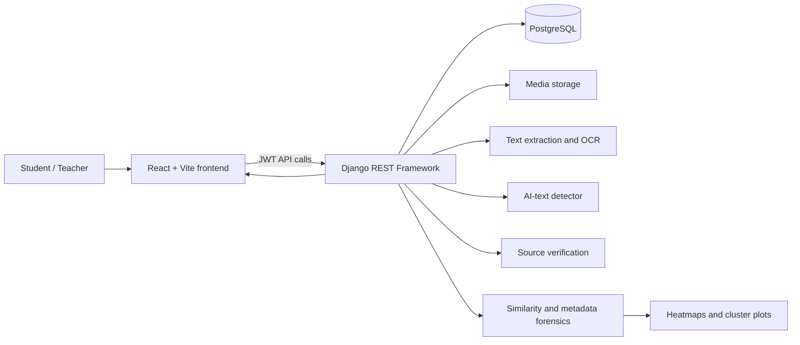
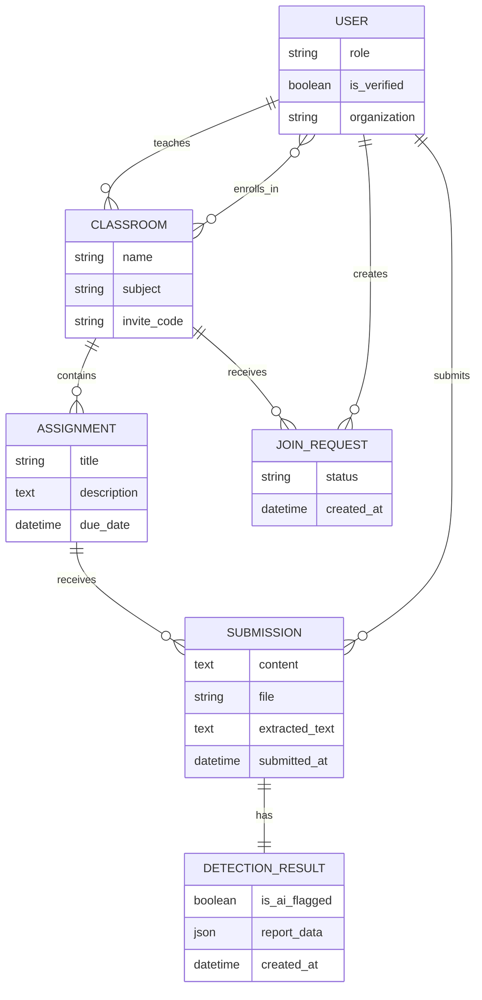
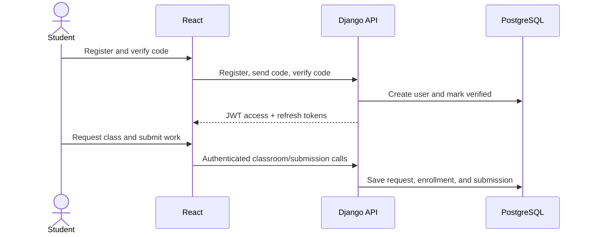
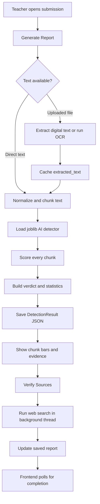
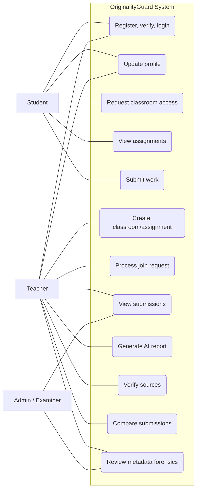
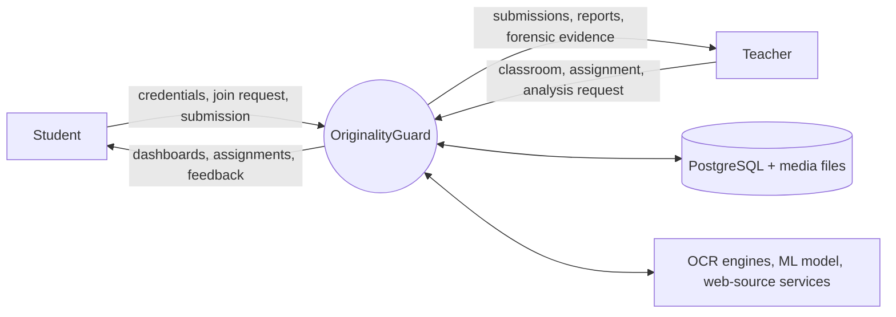

# OriginalityGuard Report

Project documentation generated from the implemented codebase. Replace `[College]`, `[Team]`, and `[Year]` before final submission.

## 1. Project overview

OriginalityGuard is a web application for academic classroom management and originality assistance. Teachers create classrooms and assignments, approve students, receive documents, and inspect analysis evidence. Students register, verify accounts, join classes, view assignments, and submit text or files before the deadline.

The system combines document extraction/OCR, chunk-level AI-text probability analysis, optional online source verification, pairwise submission similarity, and PDF/DOCX metadata forensics. It is an **originality-assistance system**, not an automatic plagiarism judgement system; the instructor remains the final decision maker.

### Objectives

1. Build role-based classroom and assignment management.
2. Support text/file submission with deadline validation.
3. Extract text from digital and scanned documents.
4. Provide AI-writing indicators and source evidence.
5. Compare submissions using several similarity measures.
6. Inspect metadata for shared origins and anomalies.
7. Present evidence through reports, charts, tables, and clusters.

## 2. Users and implemented scope

| User           | Implemented capabilities                                                                                                                            |
| -------------- | --------------------------------------------------------------------------------------------------------------------------------------------------- |
| Student        | Register, verify code, log in, update profile, request classroom access with invite code, view assignments, submit/update own work before due date. |
| Teacher        | Create classrooms/assignments, approve/reject join requests, view owned-class submissions, run reports and metadata forensics.                      |
| Admin/Examiner | The custom user model includes this role for future extension; a separate examiner UI is not implemented.                                           |

## 3. Technology stack

| Layer          | Technologies                                      | Purpose                                      |
| -------------- | ------------------------------------------------- | -------------------------------------------- |
| Frontend       | React 19, Vite, React Router, Axios, Tailwind CSS | UI, routing, styling, API communication.     |
| Backend        | Python, Django, Django REST Framework             | APIs, models, business rules, serialization. |
| Authentication | Simple JWT                                        | Access/refresh tokens and protected APIs.    |
| Database       | PostgreSQL                                        | Persistent application data.                 |
| Document tools | python-docx, pypdf/PyPDF2, python-pptx            | Text and metadata extraction.                |
| OCR            | Tesseract, EasyOCR, TrOCR, optional Google Vision | Reads scans/images.                          |
| Analysis       | joblib model, NumPy, custom vector logic          | AI-like text and similarity scoring.         |
| Source lookup  | Requests, Firecrawl and search fallbacks          | Finds possible online sources.               |
| Visualization  | Matplotlib, Seaborn, Pandas                       | Heatmap and cluster plots.                   |

## 4. System architecture

React calls Django REST APIs. Axios attaches a JWT bearer token and retries once after access-token refresh. Django persists information in PostgreSQL, handles uploaded media, and invokes analysis services.

### Frontend

`frontend-react/src/App.jsx` defines routes for authentication, dashboards, classrooms, assignments, submissions, and metadata forensics. `src/services/api.js` creates the Axios client, attaches access tokens, permits `FormData` uploads, refreshes a failed 401 once, and redirects to login if refresh fails.

Key UI components are `Login`, `Signup`, `VerifyCode`, `CompleteProfile`, `Sidebar`, teacher/student dashboards, `ClassroomDetail`, `AssignmentDetail`, `SubmissionDetail`, `HighlightedText`, `LineageGraph`, and `MetadataForensics`.

### Backend

| Django app        | Responsibility                                                                                 |
| ----------------- | ---------------------------------------------------------------------------------------------- |
| `authentication`  | Custom user, registration, verification code, JWT login/refresh, profile APIs.                 |
| `classroom`       | Classroom, assignment, join request, submission models and protected REST viewsets.            |
| `analysis_engine` | OCR, extraction, AI analysis, source search, similarity, metadata forensics and visualization. |

## 5. Database design

Implemented integrity rules: unique classroom invite codes; one join request per classroom/student; one submission per assignment/student; and no submission create/update after the deadline.

## 6. Primary workflows

### Account, classroom, and submission workflow

1. User registers; Django uses `create_user` to hash the password.
2. A six-digit verification code is generated and validated. Development email uses Django's console backend.
3. Verification returns JWT access and refresh tokens. Protected requests include `Authorization: Bearer <token>`.
4. Teacher creates a classroom and receives an invite code.
5. Student requests access; teacher accepts or rejects the pending request.
6. Teacher creates an assignment; student uploads text, a file, or both. Repeat submission updates the existing record only before the due date.

### AI analysis and source-verification workflow

`POST /api/analyze/` performs analysis only to keep the initial report responsive. `POST /api/verify-sources/` runs potentially slower source lookup in a background thread. `SubmissionDetail.jsx` polls every three seconds (up to eight attempts), then displays returned source URLs, scores, and diagnostic data.

### Similarity and metadata-forensics workflow

1. The teacher opens assignment metadata forensics, optionally selecting specific submissions.
2. The backend obtains cached text or extracts it from each submitted file.
3. Every submission pair is compared using three metrics.
4. PDF/DOCX metadata is read and an origin signature/hash is produced.
5. The engine clusters documents when origin hashes match or overall similarity reaches `0.25`.
6. It calculates metrics, likely-origin verdicts, and visualizations.
7. `MetadataForensics.jsx` displays clusters, selected-cluster matrix, metadata fields, heatmap and scatter images.

## 7. Extraction, OCR, and analysis methods

### File extraction and OCR

The extraction pipeline supports text, DOCX, PDF, PPTX, HTML and image files. Digital files first use embedded text extraction. Image files and image-based PDFs use Tesseract, EasyOCR, the Hugging Face handwritten `microsoft/trocr-base-handwritten` model, and optional Google Cloud Vision. Preprocessing includes grayscale conversion, contrast improvement, thresholding, upscaling and sharpening. The strongest useful result is cached in `Submission.extracted_text`.

Large unstructured OCR text is split into approximately 100–120 word segments, making the analysis stable and readable.

### AI-text report

The detector loads `ml_models/originality_model.joblib`. It constructs paragraph/sentence chunks and returns normalized probabilities from 0 to 1. The saved JSON report contains chunk text, word/sentence counts, probability, AI-like flag, total chunks, AI chunk count, average probability, AI-text percentage and an overall verdict. The UI uses green, amber and red probability bars so teachers can inspect evidence rather than only a final number.

### Online source verification

On demand, source verification creates search phrases from text, searches through Bing, DuckDuckGo, Google and Firecrawl-related paths, fetches page text and computes a source-match score. It can store candidate URL, confidence/score and limited search-debug information. Adjacent chunks may be combined when one chunk does not provide enough search context.

### Pairwise similarity

| Metric                             | Description                                   |
| ---------------------------------- | --------------------------------------------- |
| Jaccard similarity                 | Normalized shared token-set overlap.          |
| TF-IDF cosine similarity           | Similarity of weighted document term vectors. |
| Semantic weighted token similarity | Custom normalized weighted overlap signal.    |

`Overall similarity = (Jaccard + TF-IDF + Semantic) / 3`

The service also records chunk-level matches and considers strong chunk evidence alongside whole-document comparison. This can reveal copied passages even if the remaining text differs.

### Metadata forensics

DOCX analysis accesses author, last modifier, creation/modification times, Office application/version, editing time, saves and revision count. PDF analysis reads author, title, creator, producer, creation and modification dates; filesystem timestamps are a fallback when useful metadata is absent.

An origin signature uses available student name, document author/title/creator, filename and URL. It is normalized and SHA-1 hashed. Matching hashes indicate a shared origin signature but are not conclusive proof.

The bounded 0–1 originality score combines these weighted signals:

`Originality = 0.35 × editing + 0.25 × save/revision + 0.25 × author match + 0.15 × combined similarity/chronology`

## 8. Feature matrix

| Module              | Features implemented                                                                          |
| ------------------- | --------------------------------------------------------------------------------------------- |
| Authentication      | Registration, verification code, JWT login/refresh, logout, profile update, avatar support.   |
| Classroom           | Creation, unique invite code, join request, teacher approval/rejection, role-filtered access. |
| Assignment          | REST CRUD, due date, optional attachment.                                                     |
| Submission          | Text/file upload, one submission per student/assignment, update before deadline.              |
| OCR                 | Multi-format extraction, scan/image OCR, preprocessing, extracted-text cache.                 |
| AI report           | Chunk probabilities, flags, statistics, report persistence, chart bars.                       |
| Source verification | Explicit trigger, background operation, polling, candidate URLs/confidence.                   |
| Similarity          | Jaccard, TF-IDF, semantic scores, pairwise matrix, chunk comparison.                          |
| Forensics           | PDF/DOCX metadata, origin hash, clustering, originality/anomaly metrics.                      |
| Visual analytics    | Cluster cards, matrix, heatmap, scatter plot, lineage-related UI.                             |

## 9. REST API summary

| Endpoint                                      | Method    | Purpose                                            |
| --------------------------------------------- | --------- | -------------------------------------------------- |
| `/api/register/`                              | POST      | Create account.                                    |
| `/api/send-code/`, `/api/verify-code/`        | POST      | Send/validate verification code.                   |
| `/api/login/`, `/api/token/refresh/`          | POST      | Obtain/refresh JWT tokens.                         |
| `/api/user/profile/`                          | GET/PATCH | Get/update current profile.                        |
| `/api/classroom/classrooms/`                  | CRUD      | Manage classrooms.                                 |
| `/api/classroom/classrooms/join/`             | POST      | Request enrollment with invite code.               |
| `/api/classroom/classrooms/pending_requests/` | GET       | List teacher pending requests.                     |
| `/api/classroom/assignments/`                 | CRUD      | Manage assignments.                                |
| `/api/classroom/submissions/`                 | CRUD      | Manage submissions.                                |
| `/api/analyze/`                               | POST      | Generate AI report using `submission_id`.          |
| `/api/verify-sources/`                        | POST      | Start source verification.                         |
| `/api/plagiarism/batch/`                      | POST      | Similarity and forensics for selected submissions. |
| `/api/plagiarism/for_assignment/{id}/`        | GET       | Assignment-level metadata-forensics report.        |

## 10. Security, limitations, and deployment

Implemented protections include JWT authentication, hashed passwords, role-filtered querysets, due-date checks, teacher-only processing of join requests, and local development CORS configuration.

The analysis is evidence-based and has limits: OCR depends on scan quality and handwriting; metadata may be absent or changed; search results do not guarantee every source; and AI probability is not proof of AI use. Teachers should review evidence and academic context.

For production, move the secret key/database credentials to environment variables, set `DEBUG=False`, restrict hosts/CORS, use HTTPS and real email, validate files, add malware scanning, use secure object storage, and replace in-process threads with Celery/Redis or another job queue.

## 11. Testing and demonstration

Backend tests in `apps/analysis_engine/tests.py` cover similarity report construction, highlighting/chunk comparison, chunk splitting/merging, document-forensics output, OCR result selection, file-like text extraction, OCR normalization, cached-text behavior, and analysis of OCR-like long text.

Suggested viva demonstration: create teacher/student accounts; approve a class request; create an assignment; upload a typed DOCX and a scanned PDF; generate AI analysis; run source verification; upload two similar documents; then show the similarity cluster, metadata fields and heatmap.

## 12. Additional diagrams for the final report

### Use-case diagram

### Level-0 data-flow diagram

## 13. Suggested report structure

1. Introduction
2. Problem statement and objectives
3. Literature review / related work
4. Requirement analysis
5. System design: architecture, DFD, use case, ERD
6. Methodology and algorithms
7. Implementation
8. Testing and results with screenshots
9. Limitations and ethical considerations
10. Conclusion and future work

### Suggested conclusion

OriginalityGuard integrates classroom operations with evidence-based originality analysis. By combining OCR, AI-text indicators, web-source verification, pairwise similarity and document metadata, it helps teachers prioritize and investigate suspicious submissions. Human judgement remains central, which is technically appropriate and ethically responsible.

### Future enhancements

- Evaluate/calibrate the AI classifier on a validated dataset.
- Add precision, recall, F1-score, OCR word-error rate and processing-time evaluation.
- Add multilingual/Nepali support and embedding-based semantic comparison.
- Add Celery/Redis jobs, completion notifications and downloadable reports.
- Add rubric grading, comments, audit logs and examiner/admin analytics.
- Improve deployment security and cloud media management.

## 14. File-level implementation map

| Path                                                  | Implementation responsibility                             |
| ----------------------------------------------------- | --------------------------------------------------------- |
| `frontend-react/src/App.jsx`                          | Routes, authenticated layout and profile header.          |
| `frontend-react/src/services/api.js`                  | Axios, JWT attachment, multipart handling, token refresh. |
| `frontend-react/src/components/SubmissionDetail.jsx`  | Analysis/source buttons, polling and chunk report UI.     |
| `frontend-react/src/components/MetadataForensics.jsx` | Cluster, metadata and visualization UI.                   |
| `backend-django/apps/authentication/`                 | User, verification, token and profile logic.              |
| `backend-django/apps/classroom/`                      | Class/assignment/submission/join-request logic.           |
| `analysis_engine/ml_adapters/ocr_engine.py`           | File extraction and OCR.                                  |
| `analysis_engine/ml_adapters/detector_service.py`     | Chunking, model scoring and source orchestration.         |
| `analysis_engine/ml_adapters/firecrawl_service.py`    | Search/page retrieval/source scoring.                     |
| `analysis_engine/ml_adapters/plagiarism_vector.py`    | Pairwise similarity algorithms.                           |
| `analysis_engine/document_forensics.py`               | Metadata, clustering, scoring and visual generation.      |
| `analysis_engine/tests.py`                            | Analysis, OCR and forensics tests.                        |

---

**Writing note:** Use “flags for instructor review” rather than “automatically detects plagiarism/AI” in the final report. It accurately reflects the probabilistic, evidence-oriented implementation.
